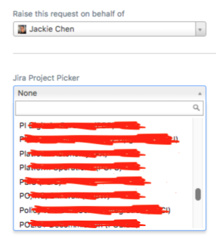
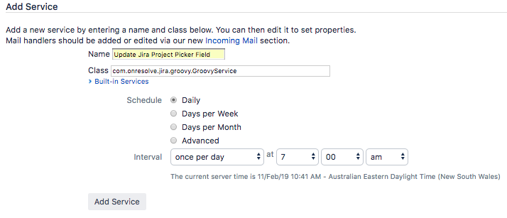
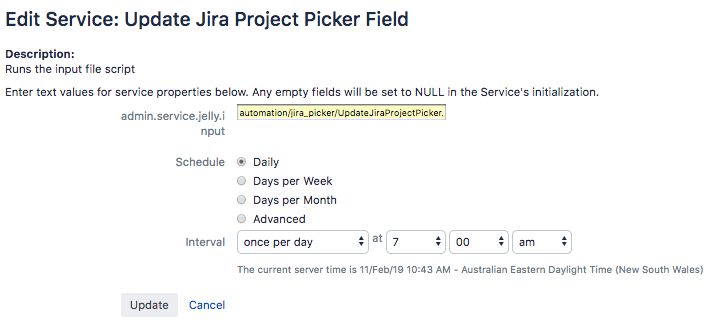

# Project Space Picker

## Overview
This is the solution to automatically update the contents of the following two custom fields in Jira. The same principle can be applied to other custom fields.
- Jira Project Picker  
- Confluence Space Picker



## Solutions
The two python scripts are used to download and parse the Jira project list and Confluence space list, then generate two files that will be used as the source for the two Jira custom fields.
- [generate_jira_project_list.py](./generate_jira_project_list.py)
- [generate_confluence_space_list.py](./generate_confluence_space_list.py)

The two groovy scripts are used to update the two Jira custom fields respectively by importing the change from the output file that is generated above.
- [UpdateJiraProjectPicker.groovy](./UpdateJiraProjectPicker.groovy)
- [UpdateConfluenceSpacePicker.groovy](./UpdateConfluenceSpacePicker.groovy)

## Requirements
- ScriptRunner
- Python

## How to use it?
Generally there are two ways to use this solution in an automatic way.

#### Schedule based
Create a service (scheduled job) in Jira to update the field content periodically. The following is a example of adding a service to update Jira Project Picker:

(1) Create a new folder inside the Jira home folder, e.g /jira_home/scripts/automation/jira_picker. 

```bash
[root@jira-server automation]# pwd
/jira_home/scripts/automation

[root@jira-server automation]# ll
total 8
drwxr-xr-x 2 root root 4096 Feb 11 10:40 confluence_picker
drwxr-xr-x 2 root root 4096 Feb 11 10:36 jira_picker
``` 

(2) Copy relevant scripts to the folder.

```bash
 [root@jira-server automation]# ll -R
.:
total 8
drwxr-xr-x 2 root root 4096 Feb 11 10:40 confluence_picker
drwxr-xr-x 2 root root 4096 Feb 11 10:36 jira_picker

./confluence_picker:
total 36
-rw-r--r-- 1 root root  2749 Feb 11 10:36 UpdateConfluenceSpacePicker.groovy
-rw-r--r-- 1 root root  1920 Feb 11 10:33 generate_confluence_space_list.py

./jira_picker:
total 32
-rw-r--r-- 1 root root  2725 Feb 11 10:36 UpdateJiraProjectPicker.groovy
-rw-r--r-- 1 root root  1594 Feb 11 10:25 generate_jira_project_list.py
```

(3) Replace os.environ['USERNAME'], os.environ['PASSWORD'] with your service account username and password in the Python script.

(4) Go to 'Jira Administration > System > Service' in Jira server.

(5) Add a new service.

 - Name: Update Jira Project Picker Field  
 - Class: com.onresolve.jira.groovy.GroovyService
 - Schedule: based on your need
 


(6) Edit service.

 - admin.service.jelly.input: automation/jira_picker/UpdateJiraProjectPicker.groovy



#### Event driven
Create an API service for this solution that can be used as a webhook by Jira and Confluence. e.g When a new project is created, Jira will call the webhook to update the Jira Project Picker field in a timely fashion.
